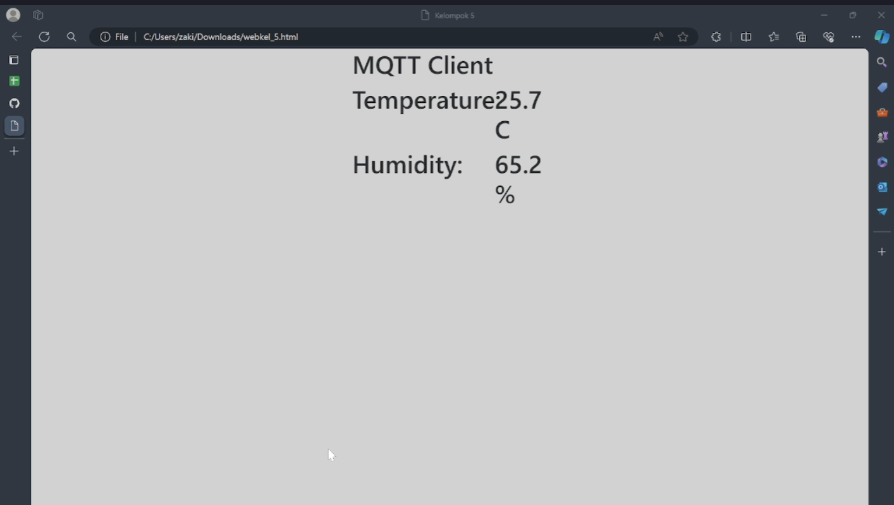

# FP-IS-5027221052-5027221065
## Tugas Final Mata Kuliah Integrasi Sistem
## Kelompok 2

| Nama                      | NRP        |
|---------------------------|------------|
| Moch Zidan Hadipratama    | 5027221052 |
| Naufan Zaki Lugmanulhakim | 5027221065 |

## Link Presentasi
[YouTube Presentation](https://youtu.be/G2u_Znn648E?si=4_GykCan0LuVDyf9)

## Project 1
### Alat dan Bahan
- DHT22 Sensor
- ESP8266
- Breadboard
- Jumper Cable

### Setup
1. Sambungkan ESP8266 untuk memasukkan program berikut:
    ```cpp
    #include <Adafruit_Sensor.h>
    #include <DHT.h>
    #include <DHT_U.h>
    #include <ESP8266WiFi.h>
    #include <PubSubClient.h>

    const char* ssid = "Galaxy J2 Prime";
    const char* pswd = "hahahalucu";
    const char* mqtt_server = "167.172.87.186";
    const char* topic = "/test/room/temperature";
    long timeBetweenMessages = 1000 * 20 * 1;

    WiFiClient espClient;
    PubSubClient client(espClient);
    long lastMsg = 0;
    int value = 0;
    int status = WL_IDLE_STATUS;

    #define DHTPIN 5
    #define DHTTYPE DHT22
    DHT_Unified dht(DHTPIN, DHTTYPE);

    uint32_t delayMS;

    void setup_wifi() {
        delay(10);
        Serial.begin(115200);
        Serial.println();
        Serial.print("Connecting to ");
        Serial.println(ssid);
        WiFi.begin(ssid, pswd);
        while (WiFi.status() != WL_CONNECTED) {
            delay(500);
            Serial.print(".");
        }
        Serial.println("WiFi connected");
        Serial.println("IP address: ");
        Serial.println(WiFi.localIP());
    }

    void callback(char* topic, byte* payload, unsigned int length) {
        Serial.print("Message arrived [");
        Serial.print(topic);
        Serial.print("] ");
        for (int i = 0; i < length; i++) {
            Serial.print((char)payload[i]);
        }
        Serial.println();
    }

    String macToStr(const uint8_t* mac) {
        String result;
        for (int i = 0; i < 6; ++i) {
            result += String(mac[i], 16);
            if (i < 5)
                result += ':';
        }
        return result;
    }

    String composeClientID() {
        uint8_t mac[6];
        WiFi.macAddress(mac);
        String clientId;
        clientId += "esp-";
        clientId += macToStr(mac);
        return clientId;
    }

    void reconnect() {
        while (!client.connected()) {
            Serial.print("Attempting MQTT connection...");
            String clientId = composeClientID() ;
            clientId += "-";
            clientId += String(micros() & 0xff, 16);

            if (client.connect(clientId.c_str())) {
                Serial.println("connected");
                String subscription;
                subscription += topic;
                subscription += "/";
                subscription += composeClientID() ;
                subscription += "/in";
                client.subscribe(subscription.c_str() );
                Serial.print("subscribed to : ");
                Serial.println(subscription);
            } else {
                Serial.print("failed, rc=");
                Serial.print(client.state());
                Serial.print(" wifi=");
                Serial.print(WiFi.status());
                Serial.println(" try again in 5 seconds");
                delay(5000);
            }
        }
    }

    void setup() {
        Serial.begin(115200);
        dht.begin();
        setup_wifi();
        client.setServer(mqtt_server, 1883);
        client.setCallback(callback);
        Serial.println(F("DHTxx Unified Sensor Example"));
        sensor_t sensor;
        dht.temperature().getSensor(&sensor);
        delayMS = 30000;
    }

    void loop() {
        delay(delayMS);
        sensors_event_t event;
        dht.temperature().getEvent(&event);
        float temp = 0;
        if (isnan(event.temperature)) {
            Serial.println(F("Error reading temperature!"));
        } else {
            Serial.print(F("Temperature: "));
            Serial.print(event.temperature);
            Serial.println(F("°C"));
            temp = event.temperature;
        }

        dht.humidity().getEvent(&event);
        float hum = 0;
        if (isnan(event.relative_humidity)) {
            Serial.println(F("Error reading humidity!"));
        } else {
            Serial.print(F("Humidity: "));
            Serial.print(event.relative_humidity);
            Serial.println(F("%"));
            hum = event.relative_humidity;
        }

        if (!client.connected()) {
            reconnect();
        }
        client.loop();

        String payload = "{\"Temp\":";
        payload += temp;
        payload += ",\"Hum\":";
        payload += hum;
        payload += "}";
        String pubTopic = topic;
        Serial.print("Publish topic: ");
        Serial.println(pubTopic);
        Serial.print("Publish message: ");
        Serial.println(payload);
        client.publish((char*) pubTopic.c_str(), (char*) payload.c_str(), true);

        delay(5000);
    }
    ```
2. Susun perangkat ESP8266, DHT22 Sensor, dan Jumper Cable seperti gambar berikut:
    

3. Buat file `HTML` dengan kode berikut:
    ```html
    <!doctype html>
    <html lang="en">
      <head>
        <title>MQTT Client</title>
        <meta charset="utf-8">
        <meta name="viewport" content="width=device-width, initial-scale=1, shrink-to-fit=no">
        <link rel="stylesheet" href="https://stackpath.bootstrapcdn.com/bootstrap/4.3.1/css/bootstrap.min.css">
      </head>
      <body>
          <div class="container-fluid">
              <div class="row justify-content-center">
                  <div class="col-3">
                    <h1>MQTT Client</h1>
                  </div>
              </div>
              <div class="row justify-content-center">
                <div class="col-2">
                  <h1>Temperature:</h1>
                </div>
                <div class="col-1">
                    <h1 id="Room-Temp">2</h1>
                  </div>
            </div>
            <div class="row justify-content-center">
                <div class="col-2">
                  <h1>Humidity:</h1>
                </div>
                <div class="col-1">
                    <h1 id="Room-Hum">2</h1>
                  </div>
            </div>
            <div class="row justify-content-center">
              <div class="col-2">
                <h1>Light:</h1>
              </div>
              <div class="col-1">
                  <button class="btn btn-primary" id="btnLed">On</button>
                </div>
          </div>
          </div>
        <script src="https://code.jquery.com/jquery-3.3.1.slim.min.js"></script>
        <script src="https://cdnjs.cloudflare.com/ajax/libs/popper.js/1.14.7/umd/popper.min.js"></script>
        <script src="https://stackpath.bootstrapcdn.com/bootstrap/4.3.1/js/bootstrap.min.js"></script>
        <script src="https://cdnjs.cloudflare.com/ajax/libs/paho-mqtt/1.0.1/mqttws31.min.js"></script>
        <script type="text/javascript">
            $(document).ready(function(){
                var Server="167.172.87.186";
                var Port="9000";
                var Topic="/test/room/temperature";
                var LedTopic="/test/room/led";
                var Connected=false;

                var clientID = "clientID_" + parseInt(Math.random() * 100);
                var client = new Paho.MQTT.Client(Server, Number(Port), clientID);

                client.onConnectionLost = onConnectionLost;
                client.onMessageArrived = onMessageArrived;

                var options = {
                  timeout: 3,
                  onSuccess: function () {
                      onConnect();
                  },
                  onFailure: function (message) {
                      console.log("On failure=" + message.errorMessage);
                  }
                };
                client.connect(options);

                $("#btnLed").click(function(){
                  if($("#btnLed").text() == "On"){
                    $("#btnLed").text("Off");
                    TurnOnOffLed("On");
                  }else{
                    $("#btnLed").text("On");
                    TurnOnOffLed("Off");
                  }
                });

                function TurnOnOffLed(Signal){
                  if(Connected){
                    var message;
                    if(Signal == "On"){
                      message = new Paho.MQTT.Message("On");
                    }else{
                      message = new Paho.MQTT.Message("Off");
                    }
                    message.destinationName = LedTopic;
                    client.send(message);
                  }
                }

                function onConnect() {
                    client.subscribe(Topic);
                    Connected=true;
                }

                function onConnectionLost(responseObject) {
                    if (responseObject.errorCode !== 0) {
                        console.log("onConnectionLost:" + responseObject.errorMessage);
                    }
                    Connected=false;
                }

                function onMessageArrived(message) {
                    var MQTTDataObject

 = JSON.parse(message.payloadString);
                    $("#Room-Temp").text(MQTTDataObject.Temp + " C");
                    $("#Room-Hum").text(MQTTDataObject.Hum + " %");
                }
            });
        </script>
      </body>
    </html>
    ```
4. Jalankan dengan `live server`.
    

## Project 2
### Alat dan Bahan
- Raspberry Pi
- Sensor DHT22
- Wemos D1 Mini ESP8266
- Kabel Jumper
- Breadboard
- LED

### Setup
1. Susun Alat dan Bahan sesuai dengan instruksi.
2. Membuat file `mqtt_sub.py` yang akan berfungsi untuk mengontrol LED pada ESP:
    ```python
    import paho.mqtt.client as mqtt
    import RPi.GPIO as GPIO
    from time import sleep

    GPIO.setwarnings(False)
    GPIO.setmode(GPIO.BOARD)
    GPIO.setup(12, GPIO.OUT, initial=GPIO.LOW)

    def on_connect(client, userdata, flags, rc):
        client.subscribe("/test/room/led")

    def on_message(client, userdata, message):
        if str(message.payload.decode("utf-8")) == "On":
            GPIO.output(12, GPIO.HIGH)
        else:
            GPIO.output(12, GPIO.LOW)
        print("message received ", str(message.payload.decode("utf-8")))

    client = mqtt.Client()
    client.on_connect = on_connect
    client.on_message = on_message
    client.connect("167.172.87.186", 1883, 60)
    client.loop_forever()
    ```
3. Menambahkan kode ini pada file `mqtt_sub.py` agar dapat memantau suhu ruangan dari `DHT22 Sensor`:
    ```python
    import paho.mqtt.client as mqtt
    import json

    def on_connect(client, userdata, flags, rc):
        client.subscribe("/test/room/temperature")

    def on_message(client, userdata, message):
        readings = str(message.payload.decode("utf-8"))
        print("message received ", readings)
        JsonReadings = json.loads(readings)
        print("Temperature=", JsonReadings["Temp"])
        if JsonReadings["Temp"] > 30:
            client.publish("/test/room/led", "On")
        else:
            client.publish("/test/room/led", "Off")

    client = mqtt.Client()
    client.on_connect = on_connect
    client.on_message = on_message
    client.connect("167.172.87.186", 1883, 60)
    client.loop_forever()
    ```
